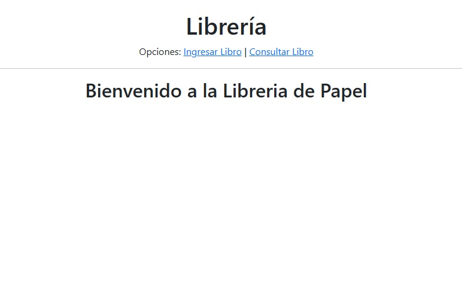
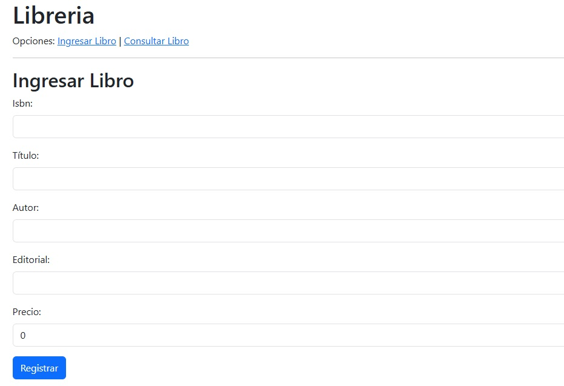
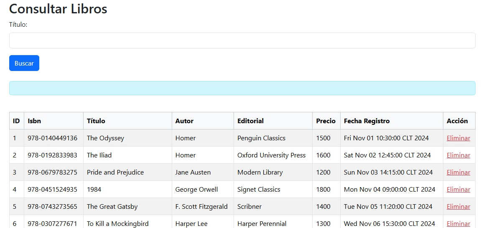

# Sistema de Registro de Libros - La Librería de Papel

## Descripción del Proyecto

Este proyecto tiene como objetivo desarrollar un sistema de registro de libros para "La Librería de Papel" que permita gestionar su catálogo en línea. Este sistema está diseñado siguiendo los estándares de la industria y utilizando patrones de arquitectura de aplicaciones web en entornos de desarrollo JAVA. La aplicación incluye funcionalidad para el registro, consulta, eliminación y gestión de libros.

---

## Competencias Asociadas

### Competencia General:
**Desarrollar aplicaciones computacionales en ambientes empresariales de acuerdo a los estándares de la industria.**

### Unidades de Competencia:
1. Diseñar componentes reutilizables en el lenguaje JAVA para solucionar problemas frecuentes.
2. Diseñar aplicaciones utilizando patrones de arquitectura de aplicaciones web en entornos de desarrollo JAVA.
3. Construir aplicaciones web utilizando lenguaje JAVA de acuerdo a arquitecturas diseñadas.
4. Verificar el funcionamiento de una aplicación web acorde a los requerimientos del negocio utilizando herramientas propias del entorno de desarrollo JAVA.

---

## Tecnologías Utilizadas

Este proyecto se ha desarrollado utilizando las siguientes tecnologías y herramientas:

- **NetBeans 8.0.2**: Entorno de desarrollo integrado (IDE) para escribir y depurar código JAVA.
- **GlassFish 4.1**: Servidor de aplicaciones para ejecutar aplicaciones web basadas en JAVA EE.
- **Conector J 5.1.23**: Driver para conectar JAVA con bases de datos MySQL.
- **PHPMyAdmin**: Herramienta para la gestión de bases de datos MySQL.
- **XAMPP**: Plataforma para configurar y administrar el entorno de desarrollo.
- **EJB**: Framework para la construcción de aplicaciones empresariales en JAVA.
- **MySQL**: Base de datos relacional para gestionar los datos de la aplicación.

---

## Prototipos de Interfaz de Usuario
### 1. Interfaz de Bienvenida

### 2. Interfaz de Ingreso de Libros

### 3. Interfaz de Consulta de Libros

#### Observaciones formulario de ingresar libro:
- Validar que el usuario ingrese valores en todos los campos.
- Indicar si el registro fue creado correctamente o si hubo problemas de validación.
- Registrar automáticamente el ID y la fecha de registro.

---

#### Observaciones consulta de libros:
- Si no se ingresa una editorial al buscar, mostrar todos los libros.
- Si se ingresa una editorial, mostrar solo los libros de esa editorial.
- Al eliminar un libro, informar al usuario que el libro fue eliminado.

---

## Modelo de Datos

### Tabla: `LIBRO`

| Campo           | Tipo de Dato      | Descripción                                    |
|------------------|-------------------|-----------------------------------------------|
| `id_libro`       | `BIGINT`          | ID de registro del libro (Autoincremental).   |
| `isbn`         | `VARCHAR(100)`    | Isbn del libro.                             |
| `titulo`         | `VARCHAR(100)`    | Título del libro.                             |
| `autor`          | `VARCHAR(100)`    | Autor del libro.                              |
| `editorial`      | `VARCHAR(100)`    | Nombre de la editorial.                       |
| `precio`         | `BIGINT`          | Precio del libro.                             |
| `fecha_registro` | `TIMESTAMP`       | Fecha y hora de creación del registro.        |

---

## Futuras Mejoras

1. Integración de una funcionalidad avanzada para gestionar usuarios con seguridad AES.
2. Incorporación de análisis de datos para identificar tendencias en el catálogo de libros.
3. Mejora del diseño de la interfaz siguiendo principios de UX/UI modernos.

---

## Licencia

Este proyecto está licenciado bajo la [Licencia MIT](LICENSE).
